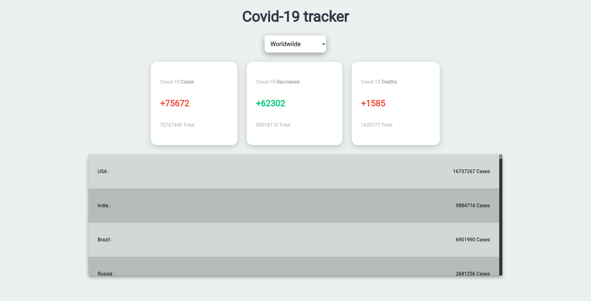
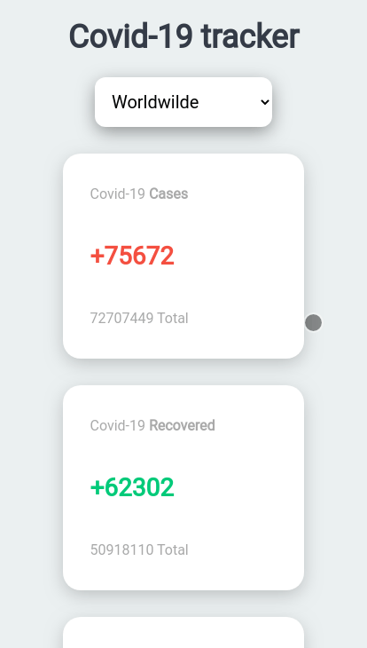

# Covid 19 Tracker

## Version 1.0.0
### [view live](https://cblokkeel.github.io/covid19-tracker)

---

Covid 19 tracker is a project created with React.JS which allow you to track Covid 19 daily and global stats for the country that you want. Theree is also a "leaderboard" with all of the countries ranked up by their global cases numbers in descending order.

---

## Preview : 

---

## Mobile version : 

---

The whole app was done by myself.
Hope that you find it cool ! :sparkles:

